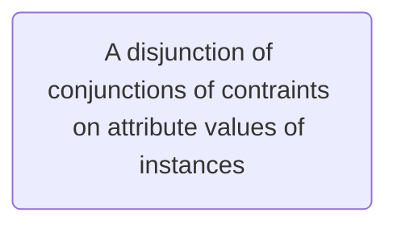

- Impurity Measures quantify the goodness of a split
- For node *m*, $N_{m}$ instances reach *m*, $N^{i}_{m}$ belong to $C_{i}$
- Probability of Class, $C_{i}:$
	- $$\hat{P}(C_{i}|x,m) \equiv p^{i}_{m} = \frac{N^{i}_{m}}{N_{m}}$$
- Node *m* is pure if $p^{i}_{m}$ is 0 or 1

![[Pasted image 20240918094245.png]]

![[Pasted image 20240918094259.png]]

