### Consider the following dataset to create a decision tree. Here the target attribute PlayTennis can have values yes or np. This is to be predicted on other attributes in question

| Day | Outlook  | Temperature | Humidity | Wind   | PlayTennis |
| --- | -------- | ----------- | -------- | ------ | ---------- |
| D1  | Sunny    | Hot         | High     | Weak   | No         |
| D2  | Sunny    | Hot         | High     | Strong | No         |
| D3  | Overcast | Hot         | High     | Weak   | Yes        |
| D4  | Rain     | Mild        | High     | Weak   | Yes        |
| D5  | Rain     | Cool        | Normal   | Weak   | Yes        |
| D6  | Rain     | Cool        | Normal   | Strong | No         |
| D7  | Overcast | Cool        | Normal   | Strong | Yes        |
| D8  | Sunny    | Mild        | High     | Weak   | No         |
| D9  | Sunny    | Cool        | Normal   | Weak   | Yes        |
| D10 | Rain     | Mild        | Normal   | Weak   | Yes        |
| D11 | Sunny    | Mild        | Normal   | Strong | Yes        |
| D12 | Overcast | Mild        | High     | Strong | Yes        |
| D13 | Overcast | Hot         | Normal   | Weak   | Yes        |
| D14 | Rain     | Mild        | High     | Strong | No         |

Which attribute should be tested first in the tree? Determine the information gain for each candidate attribute (i.e., Outlook, Temperature, Humidity, Wind) then select the one with highest information gain

---
---

## Step 1

### Attribute - Outlook

$$Values(Outlook) = Sunny, Overcast, Rain$$
$$S = [9+, 5-]$$
9+ stands for the number of 'Yes', 5- stands for the number of 'No'

$$Entropy(S) = -\frac{9}{14}\log_{2} \frac{9}{14} - \frac{5}{14}\log_{2} \frac{5}{14} = 0.94$$
$$S_{sunny} \gets [2+, 3-]$$
$$Entropy(S_{sunny}) = -\frac{2}{5}\log_{2} \frac{2}{5} - \frac{3}{5}\log_{2} \frac{3}{5} = 0.971$$
$$S_{overcast} \gets [4+, 0-]$$
$$Entropy(S_{overcast}) = -\frac{4}{4} \log_{2} \frac{4}{4} - \frac{0}{4} \log_{2} \frac{0}{4} = 0$$
$$S_{rain} \gets [3+, 2-]$$
$$Entropy(S_{rain}) = -\frac{3}{5} \log_{2} \frac{3}{5} - \frac{2}{5} \log_{2} \frac{2}{5} = 0.971$$

$$Gain(S, outlook) = Entropy(s) - \sum_{v \epsilon \{sunny, overcast, rain\} } \frac{|S_{v}|}{|S|}Entropy(S_{v})$$
$$Gain(S, outlook) = Entropy(s) - \frac{5}{14}Entropy(S_{sunny}) - \frac{4}{14}Entropy(S_{overcast}) - \frac{5}{14}Entropy(S_{rain})$$
$$Gain(S, outlook) = 0.94 - \frac{5}{14}*0.971 - \frac{4}{14}*0 - \frac{5}{14}*0.971$$
$$Gain(S, outlook)  = 0.2464$$
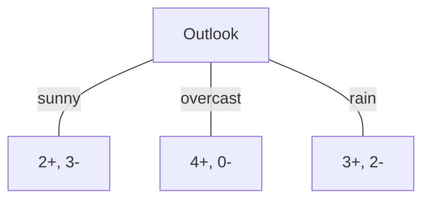

---
### Attribute - Temperature

$$Values(Outlook) = Hot, Mild, Cold$$
$$S = [9+, 5-]$$
9+ stands for the number of 'Yes', 5- stands for the number of 'No'

$$Entropy(S) = -\frac{9}{14}\log_{2} \frac{9}{14} - \frac{5}{14}\log_{2} \frac{5}{14} = 0.94$$
$$S_{hot} \gets [2+, 2-]$$
$$Entropy(S_{hot}) = -\frac{2}{4}\log_{2} \frac{2}{4} - \frac{2}{4}\log_{2} \frac{2}{4} = 1$$
$$S_{mild} \gets [4+, 2-]$$
$$Entropy(S_{mild}) = -\frac{4}{6} \log_{2} \frac{4}{6} - \frac{2}{6} \log_{2} \frac{2}{6} = 0.9182$$
$$S_{cool} \gets [3+, 1-]$$
$$Entropy(S_{cool}) = -\frac{3}{4} \log_{2} \frac{3}{4} - \frac{1}{4} \log_{2} \frac{1}{4} = 0.8113$$

$$Gain(S, temperature) = Entropy(s) - \sum_{v \epsilon \{hot,mild,cool\} } \frac{|S_{v}|}{|S|}Entropy(S_{v})$$
$$Gain(S, temperature) = Entropy(s) - \frac{4}{14}Entropy(S_{hot}) - \frac{6}{14}Entropy(S_{mild}) - \frac{4}{14}Entropy(S_{cool})$$
$$Gain(S, temperature) = 0.94 - \frac{4}{14}*1 - \frac{6}{14}*0.9182 - \frac{4}{14}*0.8113$$
$$Gain(S, temperature)  = 0.0289$$
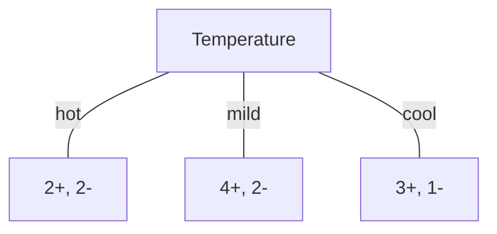

---
### Attribute - Humidity

$$Values(Humidity) = High, Normal$$
$$S = [9+, 5-]$$
9+ stands for the number of 'Yes', 5- stands for the number of 'No'

$$Entropy(S) = -\frac{9}{14}\log_{2} \frac{9}{14} - \frac{5}{14}\log_{2} \frac{5}{14} = 0.94$$
$$S_{high} \gets [3+, 4-]$$
$$Entropy(S_{high}) = -\frac{3}{7}\log_{2} \frac{3}{7} - \frac{4}{7}\log_{2} \frac{4}{7} = 0.9852$$
$$S_{normal} \gets [6+, 1-]$$
$$Entropy(S_{normal}) = -\frac{6}{7} \log_{2} \frac{6}{7} - \frac{1}{7} \log_{2} \frac{1}{7} = 0.5916$$

$$Gain(S, humidity) = Entropy(s) - \sum_{v \epsilon \{high,normal\} } \frac{|S_{v}|}{|S|}Entropy(S_{v})$$
$$Gain(S, humidity) = Entropy(s) - \frac{7}{14}Entropy(S_{high}) - \frac{7}{14}Entropy(S_{normal})$$
$$Gain(S, humidity) = 0.94 - \frac{7}{14}*0.9852 - \frac{7}{14}*0.5916 $$
$$Gain(S, humidity)  = 0.15157$$
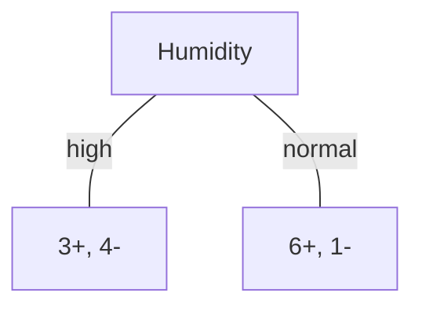

---

### Attribute - Wind

$$Values(Wind) = Weak, Strong$$
$$S = [9+, 5-]$$
9+ stands for the number of 'Yes', 5- stands for the number of 'No'

$$Entropy(S) = -\frac{9}{14}\log_{2} \frac{9}{14} - \frac{5}{14}\log_{2} \frac{5}{14} = 0.94$$
$$S_{strong} \gets [3+, 3-]$$
$$Entropy(S_{high}) = -\frac{3}{6}\log_{2} \frac{3}{6} - \frac{3}{6}\log_{2} \frac{3}{6} = 1$$
$$S_{weak} \gets [6+, 2-]$$
$$Entropy(S_{weak}) = -\frac{6}{8} \log_{2} \frac{6}{8} - \frac{2}{8} \log_{2} \frac{2}{8} = 0.8113$$

$$Gain(S, wind) = Entropy(s) - \sum_{v \epsilon \{strong,weak\} } \frac{|S_{v}|}{|S|}Entropy(S_{v})$$
$$Gain(S, wind) = Entropy(s) - \frac{6}{14}Entropy(S_{strong}) - \frac{8}{14}Entropy(S_{weak})$$
$$Gain(S, wind) = 0.94 - \frac{6}{14}*1 - \frac{8}{14}*0.8113 $$
$$Gain(S, wind)  = 0.0478$$
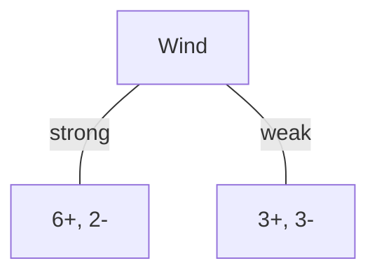

---

$$Gain(S, outlook)  = 0.246 \Longrightarrow Highest$$
$$Gain(S, temperature)  = 0.0289$$
$$Gain(S, humidity)  = 0.15157$$
$$Gain(S, wind)  = 0.0478$$Outlook is selected as the decision attribute for the root node, and branches are created below the root for each of its possible values

---
---

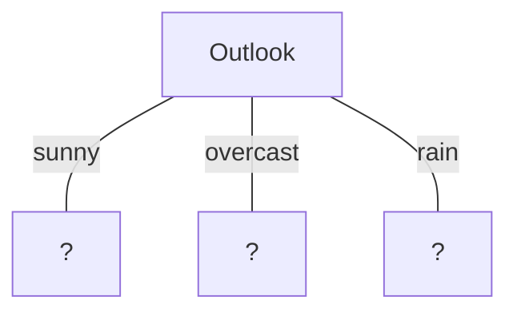

---
---

## Step 2 - For sunny
Test for cases of overcast along with the other attributes

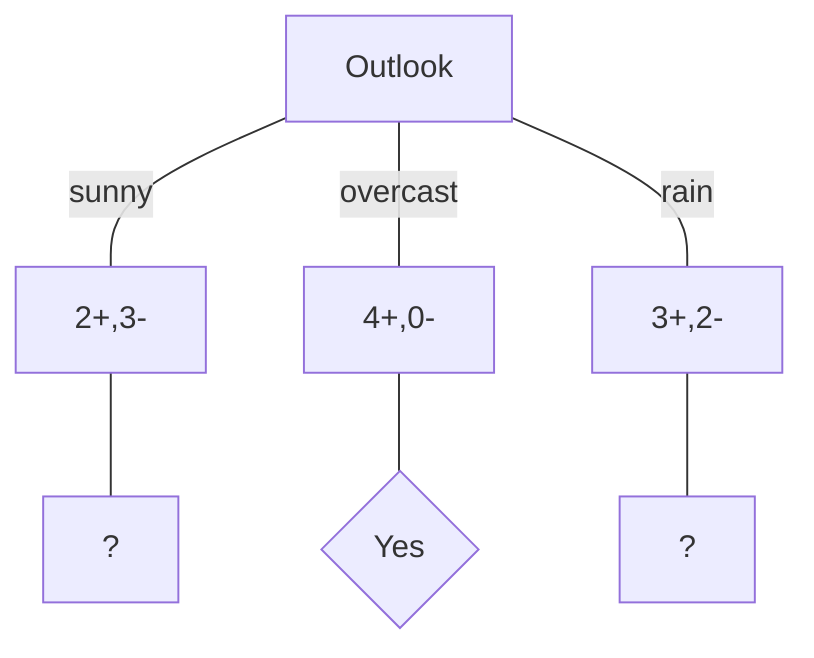

$$S_{sunny} = \Bigg \{D_{1},D_{2},D_{8},D_{9},D_{11}\Bigg \}$$

| Day | Temperature | Humidity | Wind   | PlayTennis |
| --- | ----------- | -------- | ------ | ---------- |
| D1  | Hot         | High     | Weak   | No         |
| D2  | Hot         | High     | Strong | No         |
| D8  | Mild        | High     | Weak   | No         |
| D9  | Cool        | Normal   | Weak   | Yes        |
| D11 | Mild        | Normal   | Strong | Yes        |
#### Attribute - Temperature

$$Values(Outlook) = Hot, Mild, Cold$$
$$S_{sunny} = [2+, 3-]$$
2+ stands for the number of 'Yes', 3- stands for the number of 'No'

$$Entropy(S) = -\frac{2}{5}\log_{2} \frac{2}{5} - \frac{3}{5}\log_{2} \frac{3}{5} = 0.97$$
$$S_{hot} \gets [0+, 2-]$$
$$Entropy(S_{hot}) = -\frac{0}{2}\log_{2} \frac{0}{2} - \frac{2}{2}\log_{2} \frac{2}{2} = 0$$
$$S_{mild} \gets [1+, 1-]$$
$$Entropy(S_{mild}) = -\frac{1}{2} \log_{2} \frac{1}{2} - \frac{1}{2} \log_{2} \frac{1}{2} = 1$$
$$S_{cool} \gets [1+, 0-]$$
$$Entropy(S_{cool}) = -\frac{1}{1} \log_{2} \frac{1}{1} - \frac{0}{1} \log_{2} \frac{0}{1} = 0$$

$$Gain(S_{sunny}, temperature) = Entropy(s) - \sum_{v \epsilon \{hot,mild,cool\} } \frac{|S_{v}|}{|S|}Entropy(S_{v})$$
$$Gain(S_{sunny}, temperature) = Entropy(s) - \frac{2}{5}Entropy(S_{hot}) - \frac{2}{5}Entropy(S_{mild}) - \frac{1}{5}Entropy(S_{cool})$$
$$Gain(S_{sunny}, temperature) = 0.97 - \frac{2}{5}*0 - \frac{2}{5}*1 - \frac{1}{5}*0$$
$$Gain(S_{sunny}, temperature)  = 0.57$$
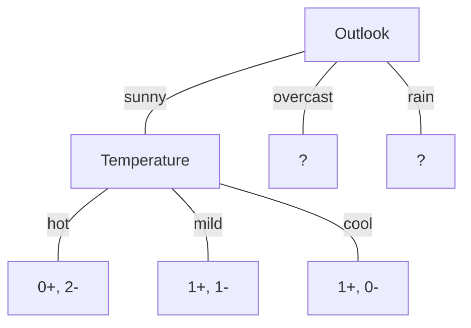

---

#### Attribute - Humidity

$$Values(Humidity) = High, Normal$$
$$S = [2+, 3-]$$
2+ stands for the number of 'Yes', 3- stands for the number of 'No'

$$Entropy(S) = -\frac{2}{5}\log_{2} \frac{2}{5} - \frac{3}{5}\log_{2} \frac{3}{5} = 0.97$$
$$S_{high} \gets [0+, 3-]$$
$$Entropy(S_{high}) = -\frac{0}{3}\log_{2} \frac{0}{3} - \frac{3}{3}\log_{2} \frac{3}{3} = 0$$
$$S_{normal} \gets [2+, 0-]$$
$$Entropy(S_{normal}) = -\frac{2}{2} \log_{2} \frac{2}{2} - \frac{0}{2} \log_{2} \frac{0}{2} = 0$$

$$Gain(S_{sunny}, humidity) = Entropy(s) - \sum_{v \epsilon \{high,normal\} } \frac{|S_{v}|}{|S|}Entropy(S_{v})$$
$$Gain(S_{sunny}, humidity) = Entropy(s) - \frac{3}{5}Entropy(S_{high}) - \frac{2}{5}Entropy(S_{normal})$$
$$Gain(S_{sunny}, humidity) = 0.97 - \frac{2}{5}*0 - \frac{2}{5}*0 $$
$$Gain(S_{sunny}, humidity)  = 0.97$$
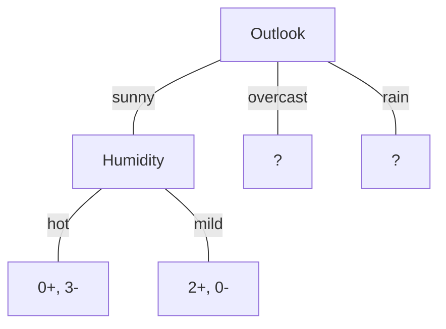

---

#### Attribute - Wind

$$Values(Humidity) = Strong, Weak$$
$$S = [2+, 3-]$$
2+ stands for the number of 'Yes', 3- stands for the number of 'No'

$$Entropy(S) = -\frac{2}{5}\log_{2} \frac{2}{5} - \frac{3}{5}\log_{2} \frac{3}{5} = 0.97$$
$$S_{high} \gets [1+, 1-]$$
$$Entropy(S_{high}) = -\frac{1}{2}\log_{2} \frac{1}{2} - \frac{1}{2}\log_{2} \frac{1}{2} = 1$$
$$S_{normal} \gets [1+, 2-]$$
$$Entropy(S_{normal}) = -\frac{1}{3} \log_{2} \frac{1}{3} - \frac{2}{3} \log_{2} \frac{2}{3} = 0.918$$

$$Gain(S_{sunny}, wind) = Entropy(s) - \sum_{v \epsilon \{strong,weak\} } \frac{|S_{v}|}{|S|}Entropy(S_{v})$$
$$Gain(S_{sunny}, wind) = Entropy(s) - \frac{3}{5}Entropy(S_{normal}) - \frac{2}{5}Entropy(S_{strong})$$
$$Gain(S_{sunny}, wind) = 0.97 - \frac{2}{5}*1.0 - \frac{3}{5}*0.918 $$
$$Gain(S_{sunny}, wind)  = 0.0192$$
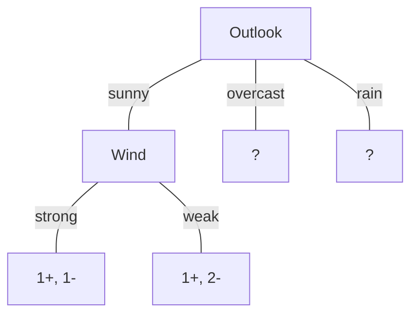
---

$$Gain(S_{sunny}, humidity)  = 0.97 \Longrightarrow Highest$$
$$Gain(S_{sunny}, temperature)  = 0.570$$
$$Gain(S_{sunny}, wind)  = 0.0192$$
---
---
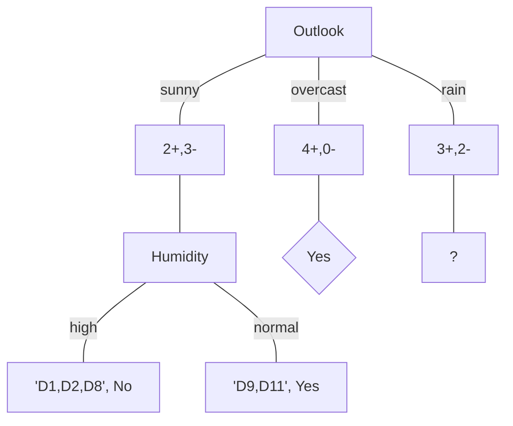

---
---

## Step 3 - For Rain

| Day | Temperature | Humidity | Wind   | PlayTennis |
| --- | ----------- | -------- | ------ | ---------- |
| D4  | Mild        | High     | Weak   | Yes        |
| D5  | Cool        | Normal   | Weak   | Yes        |
| D6  | Cool        | Normal   | Strong | No         |
| D10 | Mild        | Normal   | Weak   | Yes        |
| D14 | Mild        | High     | Strong | No         |

$$S_{rain} = \Bigg\{D_{4}, D_{5}, D_{6}, D_{10}, D_{14}\Bigg\}$$
#### Attribute - Temperature
$$Values(Temperature) = \{Hot,Mild,Cool\}$$
$$S_{rain} = [3+, 2-]$$
3+ stands for the number of 'Yes', 2- stands for the number of 'No'

$$Entropy(S) = -\frac{2}{5}\log_{2} \frac{2}{5} - \frac{3}{5}\log_{2} \frac{3}{5} = 0.97$$
$$S_{hot} \gets [0+, 0-]$$
$$Entropy(S_{hot}) = 0$$
$$S_{mild} \gets [2+, 1-]$$
$$Entropy(S_{mild}) = -\frac{2}{3} \log_{2} \frac{2}{3} - \frac{1}{3} \log_{2} \frac{1}{3} = 0.918$$
$$S_{cool} \gets [1+, 1-]$$
$$Entropy(S_{cool}) = -\frac{1}{2} \log_{2} \frac{1}{2} - \frac{1}{2} \log_{2} \frac{1}{2} = 1$$

$$Gain(S_{rain}, temperature) = Entropy(s) - \sum_{v \epsilon \{hot,mild,cool\} } \frac{|S_{v}|}{|S|}Entropy(S_{v})$$
$$Gain(S_{rain}, temperature) = Entropy(s) - \frac{0}{5}Entropy(S_{hot}) - \frac{3}{5}Entropy(S_{mild}) - \frac{2}{5}Entropy(S_{cool})$$
$$Gain(S_{rain}, temperature) = 0.97 - 0 - \frac{2}{5}*1 - \frac{3}{5}*0.918$$
$$Gain(S_{rain}, temperature)  = 0.0192$$
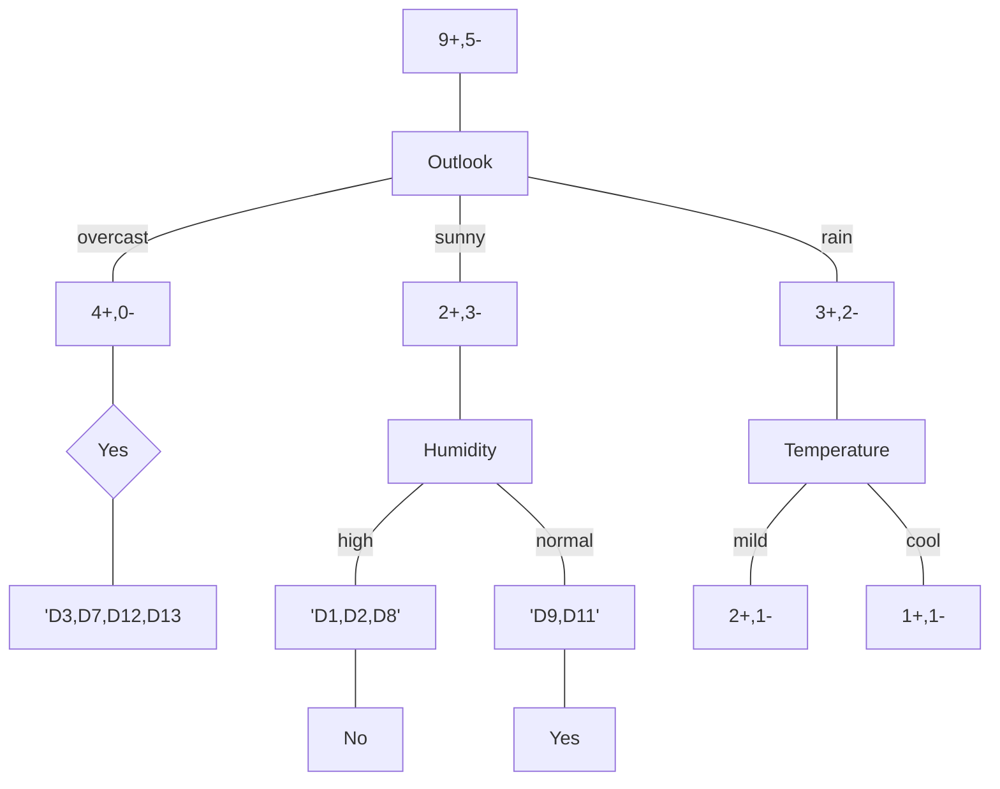

---

#### Attribute - Humidity

$$Values(Temperature) = \{High,Normal\}$$
$$S_{rain} = [3+, 2-]$$
3+ stands for the number of 'Yes', 2- stands for the number of 'No'

$$Entropy(S) = -\frac{2}{5}\log_{2} \frac{2}{5} - \frac{3}{5}\log_{2} \frac{3}{5} = 0.97$$
$$S_{normal} \gets [2+, 1-]$$
$$Entropy(S_{normal}) = -\frac{2}{3} \log_{2} \frac{2}{3} - \frac{1}{3} \log_{2} \frac{1}{3} = 0.918$$
$$S_{high} \gets [1+, 1-]$$
$$Entropy(S_{high}) = -\frac{1}{2} \log_{2} \frac{1}{2} - \frac{1}{2} \log_{2} \frac{1}{2} = 1$$

$$Gain(S_{rain}, humidity) = Entropy(s) - \sum_{v \epsilon \{high,normal\} } \frac{|S_{v}|}{|S|}Entropy(S_{v})$$
$$Gain(S_{rain}, humidity) = Entropy(s) - \frac{3}{5}Entropy(S_{normal}) - \frac{2}{5}Entropy(S_{high})$$
$$Gain(S_{rain}, humidity) = 0.97 - 0 - \frac{2}{5}*1 - \frac{3}{5}*0.918$$
$$Gain(S_{rain}, humidity)  = 0.0192$$
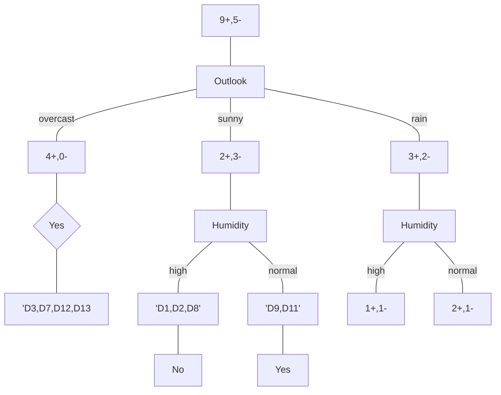

---

#### Attribute - Wind

$$Values(Temperature) = \{Strong,Weak\}$$
$$S_{rain} = [3+, 2-]$$
3+ stands for the number of 'Yes', 2- stands for the number of 'No'

$$Entropy(S) = -\frac{2}{5}\log_{2} \frac{2}{5} - \frac{3}{5}\log_{2} \frac{3}{5} = 0.97$$
$$S_{strong} \gets [0+, 2-]$$
$$Entropy(S_{strong}) = -\frac{0}{2} \log_{2} \frac{0}{2} - \frac{2}{2} \log_{2} \frac{2}{2} = 0$$
$$S_{weak} \gets [3+, 0-]$$
$$Entropy(S_{weak}) = -\frac{3}{3} \log_{2} \frac{3}{3} - \frac{0}{3} \log_{2} \frac{0}{3} = 0$$

$$Gain(S_{rain}, wind) = Entropy(s) - \sum_{v \epsilon \{strong,weak\} } \frac{|S_{v}|}{|S|}Entropy(S_{v})$$
$$Gain(S_{rain}, wind) = Entropy(s) - \frac{3}{5}Entropy(S_{weak}) - \frac{2}{5}Entropy(S_{strong})$$
$$Gain(S_{rain}, wind) = 0.97 - \frac{2}{5}*0 - \frac{3}{5}*0$$
$$Gain(S_{rain}, wind)  = 0.97$$
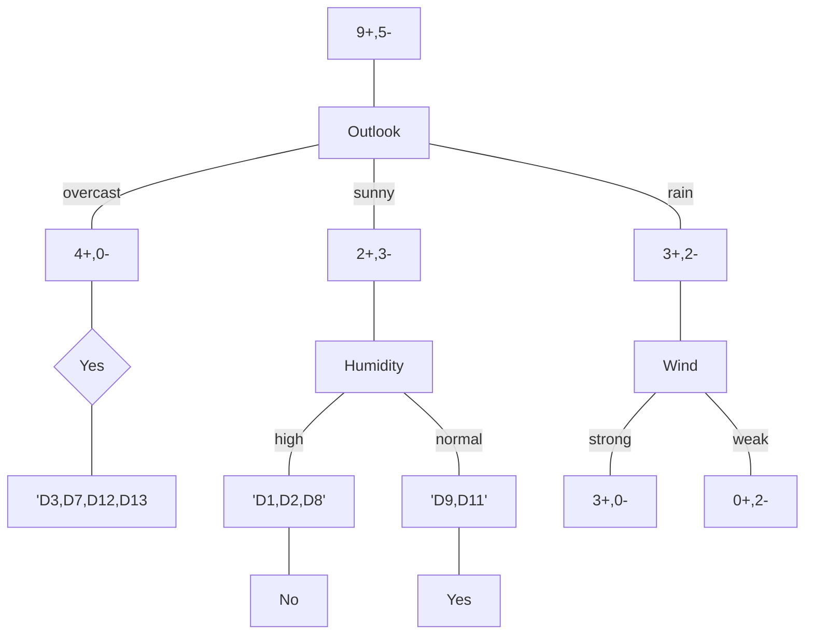

---

$$Gain(S_{rain}, wind)  = 0.97 \Longrightarrow Highest$$
$$Gain(S_{rain}, temperature)  = 0.0192$$
$$Gain(S_{sunny}, humidity)  = 0.0192$$
---
---

### FINAL TREE - 

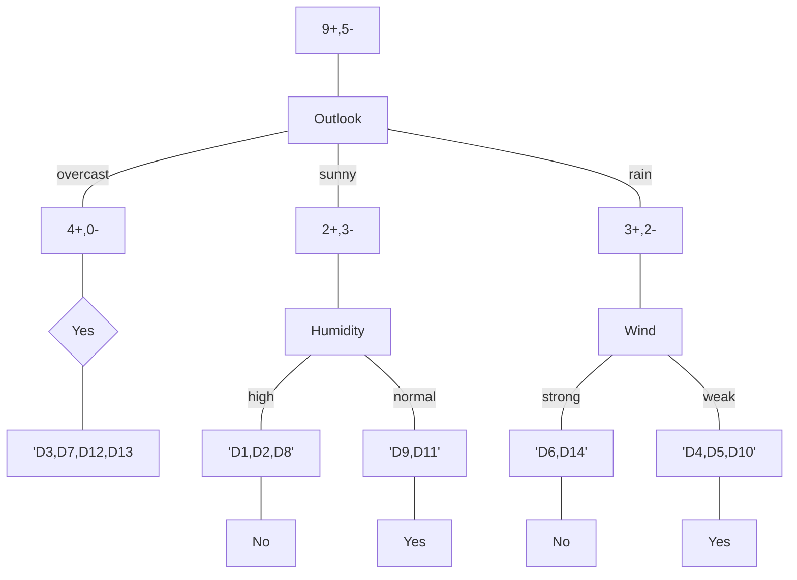

| Day | Outlook  | Temperature | Humidity | Wind   | PlayTennis |
| --- | -------- | ----------- | -------- | ------ | ---------- |
| D1  | Sunny    | Hot         | High     | Weak   | No         |
| D2  | Sunny    | Hot         | High     | Strong | No         |
| D3  | Overcast | Hot         | High     | Weak   | Yes        |
| D4  | Rain     | Mild        | High     | Weak   | Yes        |
| D5  | Rain     | Cool        | Normal   | Weak   | Yes        |
| D6  | Rain     | Cool        | Normal   | Strong | No         |
| D7  | Overcast | Cool        | Normal   | Strong | Yes        |
| D8  | Sunny    | Mild        | High     | Weak   | No         |
| D9  | Sunny    | Cool        | Normal   | Weak   | Yes        |
| D10 | Rain     | Mild        | Normal   | Weak   | Yes        |
| D11 | Sunny    | Mild        | Normal   | Strong | Yes        |
| D12 | Overcast | Mild        | High     | Strong | Yes        |
| D13 | Overcast | Hot         | Normal   | Weak   | Yes        |
| D14 | Rain     | Mild        | High     | Strong | No         |

We see that the decision tree points to exactly which dates PlayTennis is True in the table, therefore we can say that our decision tree is correct