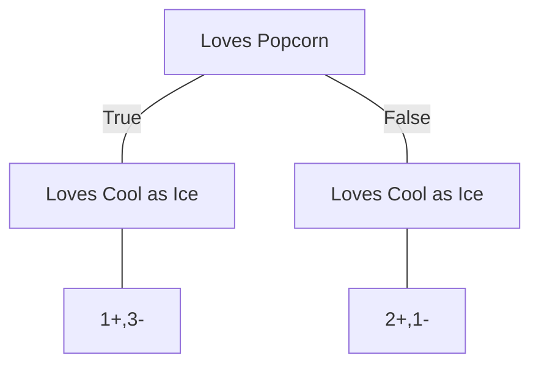
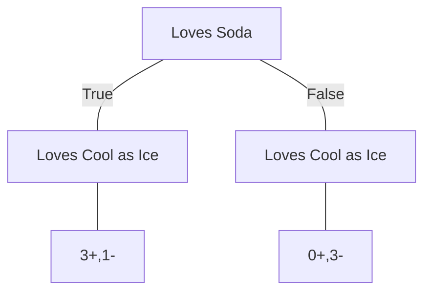

| Loves Popcorn | Loves Soda | Age | Loves 'Cool As Ice' |
| ------------- | ---------- | --- | ------------------- |
| Yes           | Yes        | 7   | No                  |
| Yes           | No         | 12  | No                  |
| No            | Yes        | 18  | Yes                 |
| No            | yes        | 35  | Yes                 |
| Yes           | Yes        | 38  | Yes                 |
| Yes           | No         | 50  | No                  |
| No            | No         | 83  | No                  |

---

$$1 - (P(Yes))^{2} - (P(No))^{2}$$

---

### Gini Impurity for Loves Popcorn

#### True

$$Gini = 1 -\left( \frac{1}{1+3} \right)^{2}  - \left( \frac{3}{1+3} \right)^2$$
$$Gini = 1 - \left( \frac{1}{4} \right)^{2} - \left( \frac{3}{4} \right)^{2}$$
$$Gini = 1 - \frac{1}{16} - \frac{9}{16} = \frac{{16-1-9}}{16} = \frac{6}{16} = 0.375$$

#### False

$$Gini = 1 -\left( \frac{2}{1+2} \right)^{2}  - \left( \frac{1}{1+2} \right)^2$$
$$Gini = 1 - \left( \frac{2}{3} \right)^{2} - \left( \frac{1}{3} \right)^{2}$$
$$Gini = 1 - \frac{4}{9} - \frac{1}{9} = \frac{{9-1-4}}{9} = \frac{4}{9} = 0.444$$

#### Total

$$Total = weighted \ average \ of \ GINI \ for \ leaves$$
$$GINI_{total} = \left( \frac{4}{4+3} \right)*0.375 + \left( \frac{3}{4+3} \right)*0.444$$
$$GINI_{total} = \left( \frac{4}{7} \right)*0.375 + \left( \frac{3}{7} \right)*0.444$$
$$GINI_{total} = 0.214 + 0.190 = 0.404$$

---

### Gini Impurity for Loves Soda

#### True

$$Gini = 1 -\left( \frac{3}{1+3} \right)^{2}  - \left( \frac{1}{1+3} \right)^2$$
$$Gini = 1 - \left( \frac{3}{4} \right)^{2} - \left( \frac{1}{4} \right)^{2}$$
$$Gini = 1 - \frac{9}{16} - \frac{1}{16} = \frac{{16-9-1}}{16} = \frac{6}{16} = 0.375$$

#### False

$$Gini = 1 -\left( \frac{0}{0+3} \right)^{2}  - \left( \frac{3}{0+3} \right)^2$$
$$Gini = 1 - \left( \frac{0}{3} \right)^{2} - \left( \frac{3}{3} \right)^{2}$$
$$Gini = 1 - 0 - 1 = 0$$

#### Total

$$Total = weighted \ average \ of \ GINI \ for \ leaves$$
$$GINI_{total} = \left( \frac{4}{4+3} \right)*0.375 + \left( \frac{3}{4+3} \right)*0$$
$$GINI_{total} = \left( \frac{4}{7} \right)*0.375 + \left( \frac{3}{7} \right)*0$$
$$GINI_{total} = 0.214$$

---

### GINI impurity for Age

**Since age has numeric values, we calculate the average Age for all adjacent people**
$$avg(7,12) = 9.5$$
$$avg(12,18) = 15$$
$$avg(18,35) = 26.5$$
$$avg(35,38) = 36.5$$
$$avg(38,50) = 44$$
$$avg(50,83) = 66.5$$

### Age $\le$ 9.5

### Age $\le$ 15

### Age $\le$ 26.5

### Age $\le$ 36.5

### Age $\le$ 44

### Age $\le$ 66.5

